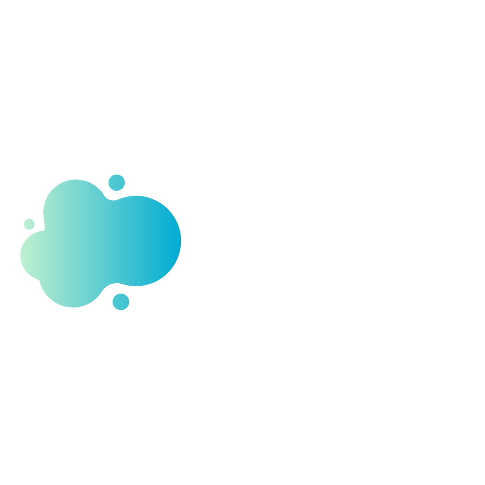

# OMEGA MEETINGS - API

Backend for the Omega Meetings Open Source Project Developed with Go.

## How It Works?

Require Docker

* `docker-compose up` For compiling and running the API on the container.

___

Require Go

* `go run *.go` For compiling and running all the go files from main.

## Collaborators

- [William Velazquez](https://williamvelazquez.com/)

## License

MIT
